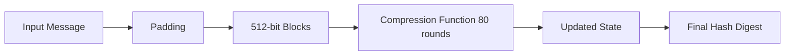

---

# 🧠 **Cryptographic Hash Functions & Python Hash Generator**

---

## 📌 **Table of Contents**
- [Fundamentals](#fundamentals-of-cryptographic-hashing)
- [Core Properties](#core-properties)
- [SHA-1 Algorithm Overview](#the-sha-1-algorithm-a-technical-overview)
- [Merkle–Damgård Construction](#the-merkle-damgard-construction)
- [Hash Generator in Python](#python-implementation-example)
- [Dictionary Attacks](#the-dictionary-attack)
- [Algorithm Comparison](#overview-of-mentioned-hash-algorithms)
- [Appendix: Complete Python Code](#appendix-hash-generator-code)

---

# 📘 **Fundamentals of Cryptographic Hashing**{#fundamentals-of-cryptographic-hashing}

A **cryptographic hash function** is a one-way mathematical operation that transforms any input into a fixed-length output.  
It behaves like a digital meat grinder:  
> No matter what chunk of meat (data) you put in, the grinder outputs a sausage (hash) of the same size — and you can NEVER reconstruct the exact original meat.

## 🎯 **Primary Purposes**
- 🔐 **Data Protection**
- ✉️ **Message Authentication**
- ✍️ **Digital Signatures**

---

# 🧩 **Core Properties**{#core-properties}

| Property | Meaning |
|--------|---------|
| **Determinism** | Same input → same output |
| **Fixed Length** | Hash size always constant |
| **Avalanche Effect** | Tiny input change → huge output change |
| **One-Way Function** | Impossible to reverse |

---

## 🧪 **Mathematical Behavior**
Inline example:  
`SHA-256("abc") → BA7816BF…`

Block example:
$$
H(x) = f(x) \mod 2^{32}
$$

---

# 🔒 **The SHA-1 Algorithm: A Technical Overview**{#the-sha-1-algorithm-a-technical-overview}

SHA-1 produces a **160-bit digest**, based on a 512-bit block structure using:

- Padding  
- Block division  
- 160-bit internal state  
- 80 compression rounds  

## 📚 **Internal State**
```

H0, H1, H2, H3, H4   → five 32-bit registers

```

---

# 🛠️ **The Merkle–Damgård Construction**{#the-merkle-damgard-construction}



### Padding Structure

```
[1][0...0][message length]
```

---

# 🐍 **Python Implementation Example**{#python-implementation-example}

Below is a minimal, conceptual structure (actual code in appendix):

```python
result = hashlib.sha256(text.encode('utf-8')).hexdigest()
print(result)
```

---

# 🗡️ **Breaking Hashes: Dictionary Attack**{#the-dictionary-attack}

> Hashes are *not decrypted*.
> They are *looked up* in giant precomputed databases.

### 🔓 **Vulnerable Inputs**

* "admin"
* "password123"

### 🛡️ **Secure Inputs**

* "Gh@27#sL_82!planetNebula"

---

# 📊 **Overview of Mentioned Hash Algorithms**{#overview-of-mentioned-hash-algorithms}

| Algorithm | Status                      | Output Size |
| --------- | --------------------------- | ----------- |
| MD4       | Obsolete                    | —           |
| MD5       | Weak but used               | 128 bits    |
| SHA-1     | Broken                      | 160 bits    |
| SHA-256   | Strong                      | 256 bits    |
| SHA-512   | Strong                      | 512 bits    |
| SHA-3     | Modern, different structure | Variable    |

---


# 🗄️ Appendix: **Hash Generator Code**{#appendix-hash-generator-code}

```python
import hashlib

text= input('Enter the text to convert into hash : ')
options = int(input('''# Hash Generator  ##
                    Choose Option: 
                    1) MD5
                    2) SHA1
                    3) SHA256
                    4) SHA512
                    5) Exit
                    '''))

log_file = "hash_log.txt"

def save_log(method , hashed_value):
    with open(log_file, 'a') as f:
        f.write(f"{method} | input :{text} | hash: {hashed_value}\n")

if options == 1 :
    result = hashlib.md5(text.encode('utf-8')).hexdigest()
    print("The generated MD5 Hash is : " , result)
    save_log('MD5', result)

elif options == 2:
    result = hashlib.sha1(text.encode('utf-8')).hexdigest()
    print("The generated SHA1 Hash is : " , result)
    save_log('SHA1',result)

elif options == 3:
    result = hashlib.sha256(text.encode('utf-8')).hexdigest()
    print("The generated SHA256 Hash is : " , result)
    save_log('SHA256',result)

elif options == 4:
    result = hashlib.sha512(text.encode('utf-8')).hexdigest()
    print("The generated SHA512 Hash is : " , result)
    save_log('SHA512', result)

elif options == 5:
    exit()

else:
    print('something went wrong')
```

---

## 📎 Footnote
```

 SHA-1 collision attacks are feasible at ~2⁶⁰ operations.

```

---
