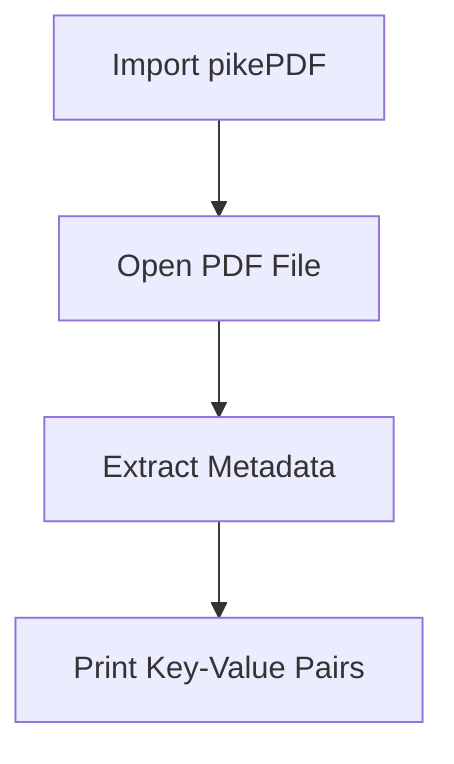
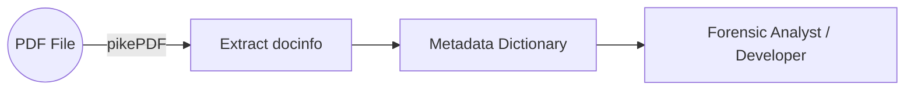

---

# 🧾 **PDF Metadata Extraction Using Python & pikePDF** {#pdf-metadata-extraction}

---

## 📌 **Table of Contents**

* [Introduction to PDF Metadata](#introduction-to-pdf-metadata)
* [Required Tools & Setup](#required-tools-and-setup)
* [Extraction Workflow](#extraction-workflow)
* [Understanding PDF Metadata Fields](#understanding-pdf-metadata-fields)
* [Python Code Explained](#python-code-explained)
* [Sample Output](#sample-output)
* [Conceptual Diagram](#conceptual-diagram)
* [Complete Code](#complete-python-code)
* [Appendix](#appendix)

---

# 📘 **Introduction to PDF Metadata** {#introduction-to-pdf-metadata}

Metadata represents *“information about information.”*
For PDFs, this includes:

* **Title**
* **Author**
* **Creation Date**
* **Producer**
* **Creator tool**
* **Modification timestamps**

> 📝 *Think of metadata as a shipping label on a package — the contents are inside, but the label reveals who made it, when it was created, and its intended name.*

---

# 🛠️ **Required Tools & Setup** {#required-tools-and-setup}

### **Python Dependency**

```bash
pip install pikepdf
```

### **Folder Structure**

Ensure the script and target PDF are stored in the **same directory**:

```
project/
│── extract_metadata.py
│── sample.pdf
```

### Tools Used

| Tool            | Purpose                       |
| --------------- | ----------------------------- |
| **pikePDF**     | PDF processing library        |
| **Python**      | Running the extraction script |
| **CLI / Colab** | Execution environment         |

---

# 🔄 **Extraction Workflow** {#extraction-workflow}

Below is the **four-step PDF metadata extraction process**:



### ✔ Summary

1. **Import** dependency
2. **Open** PDF document
3. **Extract** `docinfo` dictionary
4. **Print** metadata fields

---

# 🗂️ **Understanding PDF Metadata Fields** {#understanding-pdf-metadata-fields}

PDF metadata is stored internally as a **dictionary** of key–value pairs.

Example keys include:

| Field Name      | Meaning                       |
| --------------- | ----------------------------- |
| `/Title`        | The PDF’s assigned name       |
| `/Creator`      | Application used to create it |
| `/Producer`     | PDF producing tool            |
| `/CreationDate` | Timestamp of creation         |

### 🔍 Metadata Example

```json
{
  "/Title": "48 Laws of Power",
  "/Creator": "Adobe Acrobat",
  "/Producer": "PDF Engine X",
  "/CreationDate": "D:20230101094500"
}
```

---

# 🐍 **Python Code Explained** {#python-code-explained}

### 1️⃣ Import dependency

```python
import pikepdf
```

### 2️⃣ Open PDF document

```python
pdf = pikepdf.Pdf.open('48_laws_of_powers_-_Robert_Greene.pdf')
```

### 3️⃣ Extract metadata

```python
pdf_metadata = pdf.docinfo
```

### 4️⃣ Print metadata

```python
for key, value in pdf_metadata.items():
    print(f'{key} : {value}')
```

---

# 🖨️ **Sample Output** {#sample-output}

```
/Author : Greene, Robert
/CreationDate : D:20240618220538+00'00'
/Creator : calibre 7.4.0
/ModDate : D:20240618220538+00'00'
/Producer : calibre 7.4.0
/Title : 48 Laws of Power
```

> Output varies depending on how the PDF was created. Many online-shared PDFs may have **missing** or **scrubbed metadata** for privacy.

---

# 🧠 **Conceptual Diagram** {#conceptual-diagram}

### How Metadata Flows in a PDF Processing Pipeline



---

# 💻 **Complete Python Code** {#complete-python-code}

```python
#import the dependency
import pikepdf

#open pdf file with the pikepdf
pdf = pikepdf.Pdf.open('48_laws_of_powers_-_Robert_Greene.pdf')

# Extract the metadata from the pdf
pdf_metadata = pdf.docinfo

#print the metadata
for key, value in pdf_metadata.items():
    print(f'{key} : {value}')
```

---

# 📎 **Appendix** {#appendix}

### 📝 Notes

* Extracted metadata is always a **dictionary**
* PDF metadata is fully **searchable**
* Fields depend on the PDF creator engine
* Some PDFs have **scrubbed metadata** (common in downloads)

### 📚 Reference

Source inspiration: *Misha Sv – PDF Metadata Extraction Tutorial*

---