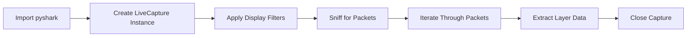

# 🌐 **Network Packet Analysis with Wireshark & PyShark** {#network-packet-analysis}

---

## 📌 **Table of Contents**
- [Project Motivation](#project-motivation)
- [Wireshark Overview](#wireshark-overview)
- [Display Filters](#display-filters)
- [PyShark Introduction](#pyshark-introduction)
- [PyShark Setup & Dependencies](#pyshark-dependencies)
- [Live Capture Workflow](#live-capture-workflow)
- [Accessing Packet Data](#accessing-packet-data)
- [Memory Management Concerns](#memory-management)
- [Complete Python Code](#complete-python-code)
- [Appendix](#appendix)

---

# 🎯 **Project Motivation** {#project-motivation}

The tutorial centers around analyzing network traffic to confirm whether a **Reolink doorbell camera** was secretly sending data outside the local network.  
This was part of a larger project to build *Shane*, a fully local, privacy-focused digital assistant.

> **Outcome:** The creator *could not access* the traffic from the camera.  
> Hypothesis:  
> The camera sends traffic **only to the router**, bypassing visibility on the monitoring device.

The tutorial then shifts to explaining the tools—**Wireshark** and **PyShark**—for general packet analysis.

---

# 🐬 **Wireshark Overview** {#wireshark-overview}

Wireshark is the world’s most used **network packet analyzer**.

### 🔧 Setup
- Download from: https://www.wireshark.org/download.html
- Install and run normally.

### 🔍 Basic Operation
1. Select the **Wi-Fi** (or Ethernet) interface.
2. Click **Start Capturing Packets**.
3. Watch real-time packets flowing through the network.

### Information Shown
Each packet displays:
- Source IP  
- Destination IP  
- Protocol  
- Layers (Ethernet, IP, TCP/UDP, HTTP, etc.)

Clicking a packet opens **huge JSON-like structures** representing protocol layers.

### 🎨 Color Coding
Wireshark colorizes packets to differentiate:
- TCP streams  
- ARP  
- DNS  
- Errors  
- Warnings  

---

# 🚦 **Display Filters** {#display-filters}

Filters limit visible traffic.

### Common Examples
| Purpose | Filter |
|---------|---------|
| Filter by IP | `ip.addr == 192.168.0.10` |
| Filter by Source IP | `ip.src == 10.0.0.145` |
| Filter by HTTP only | `http` |
| Filter by DNS | `dns` |


---

# 🐍 **PyShark: Python Packet Analysis** {#pyshark-introduction}

**PyShark** is a Python wrapper for **TShark**, the command-line version of Wireshark.

It allows:
- Automated packet capture  
- Filtering  
- Accessing packet layers  
- Integrating packet monitoring into applications  
(e.g., the *Shane* assistant)

---

# ⚙️ **PyShark Setup & Dependencies** {#pyshark-dependencies}

### 📌 Install PyShark
```bash
pip install pyshark
```

### 📌 Critical Dependency: **Npcap**

PyShark requires **Npcap** or WinPcap for network sniffing.

Download from: [https://npcap.com](https://npcap.com)

If Npcap is missing:

* PyShark errors
* Interface list is empty
* No packets can be sniffed

---

# 🔄 **Live Capture Workflow** {#live-capture-workflow}

Here is the step-by-step flow:



### Creating a Live Capture

```python
capture = pyshark.LiveCapture(interface=interface_selected)
```

### Optional: add filters

```python
capture = pyshark.LiveCapture(
    display_filter='ip.addr == 10.0.0.5',
    interface=interface_selected
)
```

### Start sniffing

```python
capture.sniff(timeout=50)
```

### Iterate through packets

```python
for packet in capture:
    print(packet)
```

### Close session

```python
capture.close()
```

---

# 🧵 **Accessing Packet Data** {#accessing-packet-data}

### 🔎 Full packet (JSON-like)

```python
print(packet)
```

### 🔎 Specific fields

```python
print(packet.ip.src)
print(packet.ip.dst)
print(packet.tcp.port)
print(packet.http.user_agent)
```

### Packet layer structure

Each packet consists of layers:

```
eth → ip → tcp → http
```

You can inspect layers directly:

```python
packet['ip'].dst
packet['tcp'].flags
```

---

# 🧠 **Memory Management Concerns** {#memory-management}

Continuous packet capture consumes **massive memory**.

### ⚠ Problems

* RAM may fill
* System may freeze
* Capture may crash

### ✔ Solutions

* Use `timeout=<seconds>`
* Use **sniff_continuously()** *with caution*
* Use a **dedicated cybersecurity machine**
* Or store packets to a file instead

### Recommended safe capture:

```python
capture.sniff(timeout=20)
```

---

# 🧾 **Complete Python Code** {#complete-python-code}

```python
import pyshark

# Wi-Fi interface (found using `tshark -D`)
interface_selected = 

# Create a packet capture instance
capture = pyshark.LiveCapture(interface=interface_selected)

# Enable debug mode
capture.set_debug()

# Start capturing packets for 50 seconds
capture.sniff(timeout=50)

# Process captured packets
for packet in capture:
    print(packet)

# Stop the packet capture
capture.close()

# PyShark documentation:
# https://pyshark-packet-analysis.readthedocs.io/en/latest/
```

---

# 📁 **Appendix** {#appendix}

### 📎 Additional Notes

* PyShark is ideal for Python automation.
* Wireshark is best for manual visual inspection.
* PyShark uses the same **display filters** as Wireshark.
* To access *other devices’* traffic, you often need:

  * Router-level packet capture
  * Promiscuous mode
  * Monitor mode (Linux)
  * Or a managed switch with port mirroring

### 🧰 Recommended Tools

* **Tcpdump** (Linux CLI sniffer)
* **Wireshark** GUI
* **TShark** CLI
* **Npcap** driver
* **Scapy** (advanced packet crafting)

### 📚 Reference

Tutorial inspiration: *Wireshark & PyShark packet analysis guide*

---

